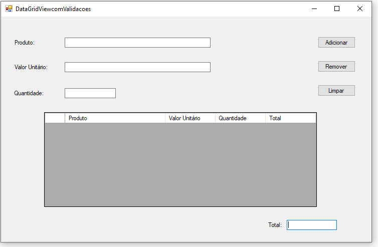
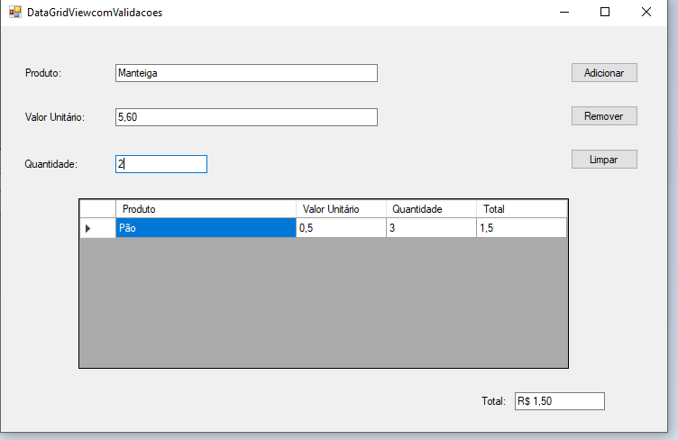
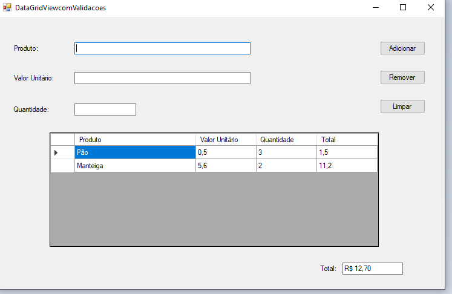

# aulaDataGridViewComValidacoes-CSharp
aula com DataGridView e Validações no Visual studio usando C#.
  

  <h3>Página inicial</h3>
  

  

  <h3>É como um rolê de supermercado. Você cadastrar o nome e o preço e soma tudo embaixo.</h3>
  

